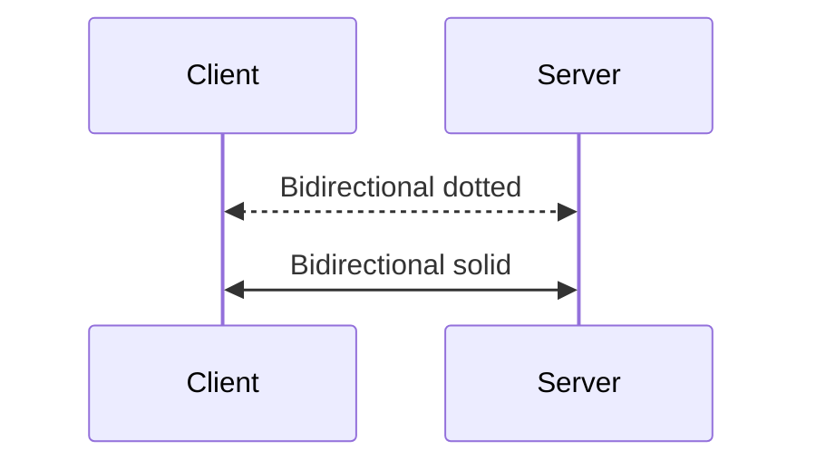

# Variables in many contexts

Inline code: `Bearer <<apiKey>>` and `{user.region}`.

Standalone variable in a table cell:

| Field   | Value           |
| ------- | --------------- |
| API key | <<apiKey>>      |
| Region  | {user.region}   |

Mermaid sequence diagram — `<<-->>` and `<<->>` must NOT be substituted
as legacy variables:

Closing prose with a glossary term: <Glossary>acme</Glossary>.
