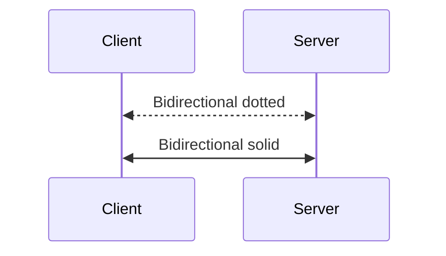

# Variables in many contexts

Inline code: `Bearer <<apiKey>>` and `{user.region}`.

Standalone variable in a table cell:

| Field   | Value           |
| ------- | --------------- |
| API key | <<apiKey>>      |
| Region  | {user.region}   |

Mermaid sequence diagram — `<<-->>` and `<<->>` must NOT be substituted
as legacy variables:

```mermaid
sequenceDiagram
  Client <<-->> Server: Bidirectional dotted
  Client <<->> Server: Bidirectional solid
```

Component attributes resolve at render time, and only for `{user.*}`. Legacy
`<<...>>` in a quoted attribute is valid MDX, but is not resolved there and
stays literal:

<Accordion title={user.region} icon="fa-rocket">
Accordion body with <<apiKey>>
</Accordion>

<Cards>
  <Card title="Key: {user.apiKey} / <<apiKey>>" href="https://example.com/{user.region}">
  Card body
  </Card>
</Cards>

Closing prose with a glossary term: <Glossary>acme</Glossary>.
