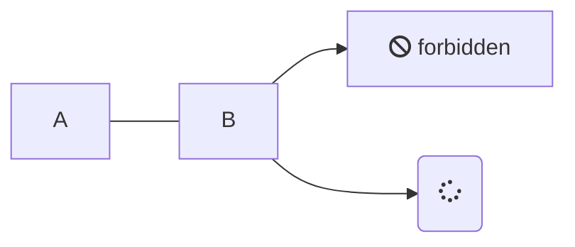
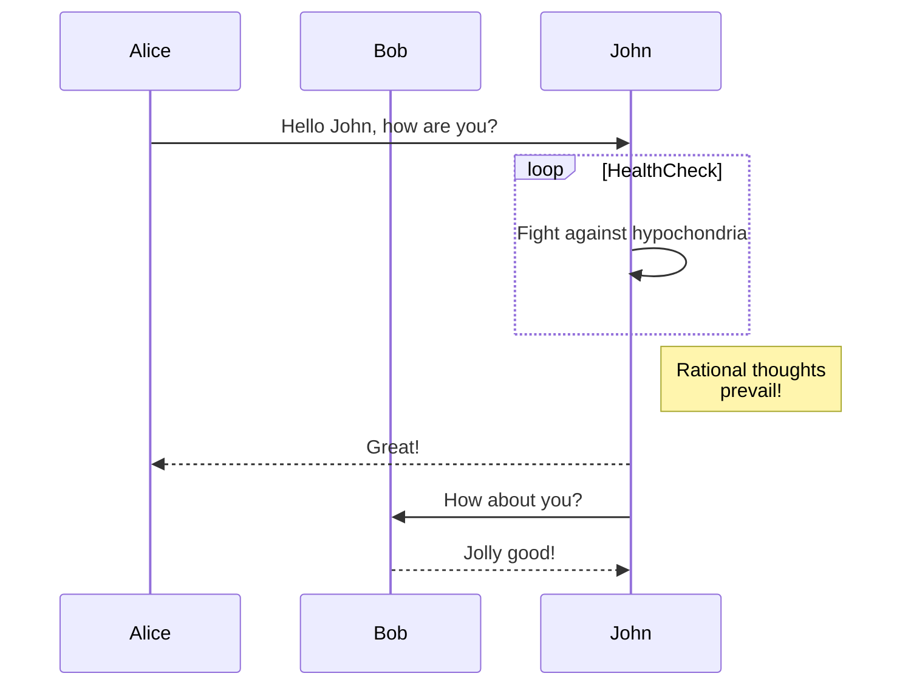
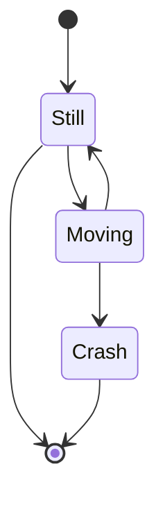
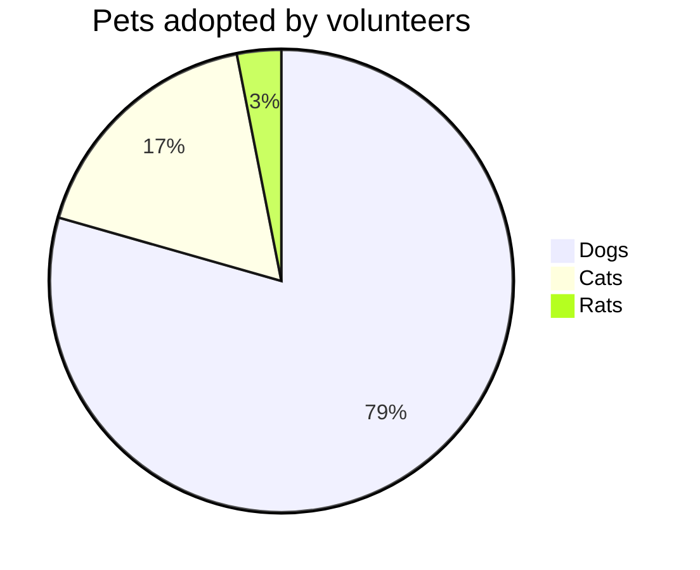
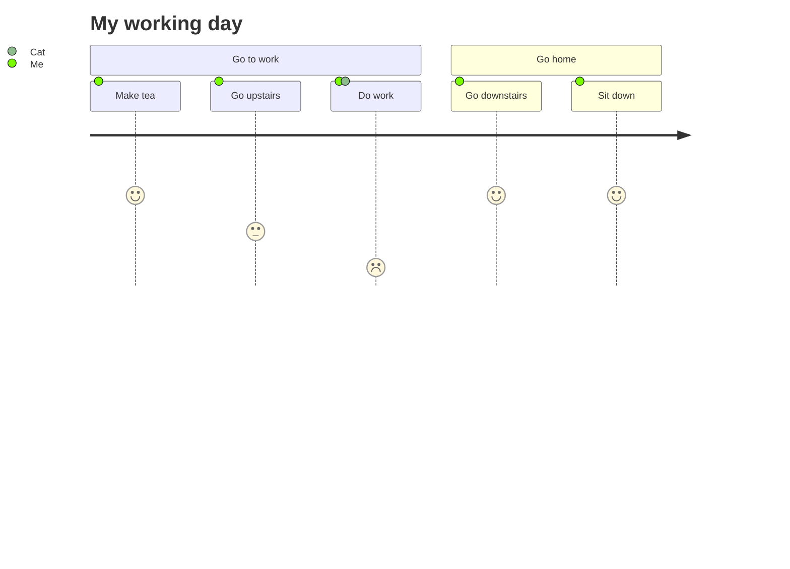

## Examples

### Single Diagram





### Multiple Tabs

```mermaid
    ---
    title: Animal example
    ---
    classDiagram
        note "From Duck till Zebra"
        Animal <|-- Duck
        note for Duck "can fly\ncan swim\ncan dive\ncan help in debugging"
        Animal <|-- Fish
        Animal <|-- Zebra
        Animal : +int age
        Animal : +String gender
        Animal: +isMammal()
        Animal: +mate()
        class Duck{
            +String beakColor
            +swim()
            +quack()
        }
        class Fish{
            -int sizeInFeet
            -canEat()
        }
        class Zebra{
            +bool is_wild
            +run()
        }
```




```syntax
    journey
        title My working day
        section Go to work
          Make tea: 5: Me
          Go upstairs: 3: Me
          Do work: 1: Me, Cat
        section Go home
          Go downstairs: 5: Me
          Sit down: 5: Me
```
